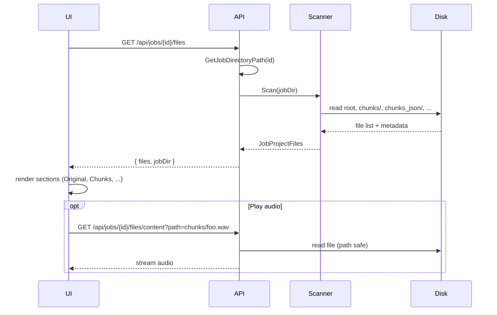

# XtractManager (agent05-ui-control)

Аналог agent-browser: веб-UI и API для пайплайна **транскрипция (agent04) + refiner (agent06)**. Интеграция с agent04 и agent06 — только по **gRPC**.

## Структура

- **API/** — бекенд (.NET 9): решение `Api.slnx` (проекты Api, API.Tests). Сборка и запуск из `API/`.
- **UI/** — фронтенд (React 18 + Vite, TypeScript). Сборка и запуск из `UI/`.
- **docs/** — стандарты (API_STANDARDS.md, AUTH.md, FRONTEND_STANDARDS.md), паритет и сканер файлов (**JOB_FILES_SCANNER_AND_AGENTS.md**, **PARITY_MINIMUM_READINESS.md**).

## Запуск

### Требования

- .NET 9 (API)
- Node.js 18+ (UI)
- Запущенные **agent04** (gRPC) и **agent06** (gRPC) на нужных портах

### API

```bash
cd agent05-ui-control/API
dotnet build
dotnet run
```

По умолчанию API слушает **http://localhost:5010**.

Для использования своих адресов agent04/agent06 задайте переменную окружения и при необходимости скопируйте/отредактируйте `appsettings.Development.json`:

```bash
# Windows (PowerShell)
$env:ASPNETCORE_ENVIRONMENT="Development"; dotnet run

# Windows (CMD) / Linux / macOS
set ASPNETCORE_ENVIRONMENT=Development   # CMD
dotnet run
```

В `appsettings.Development.json` по умолчанию: Agent04 gRPC — http://localhost:5032, Agent06 — http://localhost:5033. Адреса можно изменить там же. У **Agent04** публичный API только **gRPC** на этом порту (h2c).

### UI

```bash
cd agent05-ui-control/UI
npm install
npm run dev
```

UI откроется на **http://localhost:5173** и по прокси обращается к API на http://localhost:5010. Убедитесь, что API запущен.

Сборка UI для продакшена:

```bash
npm run build
```

Артефакты — в `UI/dist/`.

### Вкладки Transcriber / Refiner / Result

- **Transcriber** — статус/фаза, логи (SSE), **панель управления чанками** (запросы к Agent04: отмена чанка и пр.; опционально фильтр списка файлов по индексу чанка), полный список файлов проекта (`jobDir`, обновление списка).
- **Refiner** — те же **логи** (тот же буфер, что и у задания; отдельный поток только под рефайнер или фильтр по фазе **не реализованы**), блок как на **Result**: метаданные (Job ID, файл, статус, фаза, путь к папке), быстрые ссылки на ключевые файлы, список транскриптов с редактором. Подсказки по фазе (`awaiting_refiner` / `refiner` / `completed`) над логами.
- **Result** — **логи** (тот же буфер SSE, что на Transcriber/Refiner), затем **ResultSection**: метаданные, быстрые ссылки в браузере на `transcript.md`, `transcript_fixed.md`, нумерованные **`transcript_fixed_*.md`** (например `transcript_fixed_1.md`), `response.json`, список транскриптов с редактором.

Опционально из плана паритета со старым UI **не делаются** без доработки API: превью текста рефайнинга из логов (`RefiningTextPreview`), кнопки повторного запуска / пропуска рефайнера.

## Конфигурация API

Файл: `API/appsettings.json` (и при необходимости `appsettings.Development.json`).

| Секция       | Ключ           | Описание                                              |
|-------------|----------------|--------------------------------------------------------|
| Kestrel     | Endpoints:Http | URL API (по умолчанию http://localhost:5010)          |
| Agent04     | GrpcAddress   | Адрес **gRPC** agent04 (транскрипция), h2c: **http://localhost:5032**. REST у agent04 нет. |
| Agent04     | ConfigPath    | Путь к конфигу agent04 (например config/default.json) |
| Agent04     | WorkspaceRoot | Рабочий каталог agent04 (пустой — подставляется Jobs:WorkspacePath) |
| Agent06     | GrpcAddress   | Адрес gRPC agent06 (refiner)                          |
| Agent06     | WorkspaceRoot | Корень workspace **agent06** (тот же смысл, что `WorkspaceRoot` в appsettings agent06). Нужен, чтобы путь `output_file_path` в gRPC совпадал с диском: пайплайн передаёт относительный путь `{jobId}/transcript_fixed.md`. Пустая строка или отсутствие ключа — используется тот же каталог, что и **Jobs:WorkspacePath** (оба сервиса должны видеть один и тот же `runtime`). Если у agent06 другой корень — задайте здесь **абсолютный** путь к тому же каталогу, что и задания, либо путь, относительно Content Root API. |
| Jobs        | WorkspacePath | Каталог для рабочих данных заданий (аудио, артефакты). Абсолютный путь или относительный от Content Root. По умолчанию `./runtime`. Логи приложения — в корень запущенного проекта. |

При старте в лог выводится фактический путь: `Job workspace base path (Jobs:WorkspacePath): ...`. Оба внешних сервиса вызываются только по gRPC; REST для agent06 не используется.

### gRPC по HTTP (без TLS)

При работе по `http://` (без HTTPS) gRPC использует HTTP/2 «prior knowledge» (h2c). Чтобы избежать ошибки `HTTP_1_1_REQUIRED` (0xd):

- **agent05**: в `Program.cs` включён `AppContext.SetSwitch("System.Net.Http.SocketsHttpHandler.Http2UnencryptedSupport", true)` — клиент подключается по h2c к agent04 и agent06.
- **agent04**: на Windows без TLS Kestrel по умолчанию не включает HTTP/2. В Agent04 в `Program.cs` настроен порт **5032** только для gRPC (h2c): `ConfigureKestrel` с `AllowAlternateSchemes = true` и `ListenLocalhost(5032, HttpProtocols.Http2)`. Адрес `Agent04:GrpcAddress` в agent05 — **http://localhost:5032**.

## Endpoints

| Метод  | Путь                    | Описание |
|--------|-------------------------|----------|
| GET    | /health                 | Проверка состояния (JSON: status, service) |
| GET    | /api/jobs               | Список заданий. Query: semanticKey, status, from, to, limit, offset. Ответ: `{ "jobs": JobListItem[] }`. |
| GET    | /api/jobs/{id}          | Снепшот задания (JobSnapshot). 404 если нет. Поле `files` в JSON больше не заполняется — список файлов: **GET /api/jobs/{id}/files**. Во время транскрипции могут быть **`agent04JobId`**, **`chunks`** (`total`, `completed`, `active`, …). |
| POST   | /api/jobs/{id}/chunk-actions | Операторские действия по чанку → gRPC Agent04 `ChunkCommand`. Тело JSON: **`action`**: `cancel` \| `skip` \| `retranscribe` \| `split`, **`chunkIndex`**: неотрицательный индекс (0-based). Допустимо только при **`phase`** = `transcriber` и **`status`** = `running`. Ответ 200: `{ "ok": bool, "message": string }`. Ошибки gRPC: 400 / 404 / 409 / 502. |
| POST   | /api/jobs               | Создать задание. Form: file (обязательно), tags (опционально, строка через запятую). Ответ: 202, `{ "jobId": string }`. Пайплайн запускается в фоне (agent04 → agent06). Лимит тела запроса 512 MB. |
| DELETE | /api/jobs/{id}          | Удалить задание. 204 при успехе, 404 если нет. |
| GET    | /api/jobs/{id}/stream   | SSE: первый ответ — snapshot (type: "snapshot", payload: JobSnapshot), далее события type: "status" | "done". При "done" стрим завершается. |
| GET    | /api/jobs/{id}/files    | Структурированный список файлов задания (как в agent-browser). См. ниже. |
| GET    | /api/jobs/{id}/files/content | Отдача файла из каталога задания по относительному пути. Query: **path** (обязательно), например `path=chunks/foo_part_000.wav`. Поддержка Range для аудио. |
| PUT    | /api/jobs/{id}/files/content | Перезапись **существующего** текстового файла (UTF-8 без BOM). Тот же query **path**. Тело запроса — сырое содержимое (`text/plain` или любой тип). Расширения: `.md`, `.txt`, `.json`, `.log`, `.text`, `.srt`, `.vtt`, `.csv`, `.xml`, `.flag`. Лимит тела 50 MB. Ответ 200: `{ "ok": true, "message": "..." }`. |

### Файлы проекта: `GET /api/jobs/{id}/files`

Ответ **200**: `{ "files": { ... }, "jobDir": "<абсолютный путь к каталогу задания>" }`.

Объект **`files`** (имена полей в JSON — camelCase):

| Поле | Описание |
|------|----------|
| `original` | Корневые аудио (m4a, mp3, wav, ogg, flac). |
| `transcripts` | Корневые транскрипты/JSON: имя содержит `transcript`, или `.md`, или `.json`. |
| `chunks` | Файлы в `chunks/` (индекс чанка из имени файла). |
| `chunkJson` | Файлы в `chunks_json/`. |
| `intermediate` | `intermediate_results/`. |
| `converted` | `converted_wav/`. |
| `splitChunks` | `split_chunks/chunk_N/…` (аудио подчанков и результаты в `results/`). |

Элемент списка — объект с полями вроде `name`, `relativePath`, `sizeBytes`, `kind` (`text` | `audio` | `other`), при необходимости `lineCount`, `durationSeconds`, `index`, `parentIndex`, `subIndex`, `hasTranscript`, `isTranscript`.

#### Сканер vs Agent04 / Agent06 (§6 плана)

Кратко: **Agent04** при типичном `default.json` заполняет `chunks/`, `chunks_json/`, `converted_wav/`, `intermediate_results/`, корневые транскрипты; **не** создаёт `split_chunks/chunk_*`. **Agent06** добавляет в основном **`transcript_fixed*.md`** в корень задания (категория `transcripts`). Подробные таблицы, паттерны имён и расхождения — **[docs/JOB_FILES_SCANNER_AND_AGENTS.md](docs/JOB_FILES_SCANNER_AND_AGENTS.md)**.

**404**: каталог задания на диске отсутствует. Если задания нет и в хранилище — тело пустое; если задание есть в store, но папки нет — `{ "error": "job directory not found" }`.

**Архивные задания**: если каталог `{id}` под `Jobs:WorkspacePath` есть, а записи в store уже нет, ответ **200** всё равно возвращается (удобно для папок, оставшихся после перезапуска).

### Раздача файла: `GET /api/jobs/{id}/files/content?path=...`

- **path** — путь **относительно** каталога задания, сегменты `.` и `..` запрещены; выход за пределы каталога даёт **403** `{ "error": "access denied" }`.
- **400**: нет `path` или неверный путь.
- **404**: нет каталога задания или файла.
- Тип содержимого выбирается по расширению (аудио, markdown, json и т.д.); иначе `application/octet-stream`.

UI использует эти эндпоинты для списка секций (Transcriber / Refiner / Result) и ссылок «Открыть» / `<audio src=…>`.

### Поток данных: структурированные файлы проекта (UI)

Схема из плана «Project files like old Transcriber tab»: UI не берёт дерево файлов из снапшота задания, а запрашивает отдельный ресурс; метаданные читает сканер с диска.



### Сохранение текстового файла: `PUT /api/jobs/{id}/files/content?path=...`

Как в agent-browser: файл уже должен существовать; создать новый через этот эндпоинт нельзя. Недопустимые расширения → **400** `only text-like files can be saved`.

В Development при включённом OpenAPI: **GET /openapi/v1.json** — схема API.

## Тесты API

```bash
cd agent05-ui-control/API
dotnet test
```

Среди прочего: **`ChunkActionsControllerTests`** — `POST /api/jobs/{id}/chunk-actions` с моком **`ITranscriptionServiceClient`**.

## Документация и план

- **docs/API_STANDARDS.md** — стандарты бекенда.
- **docs/FRONTEND_STANDARDS.md** — стандарты фронтенда.
- **docs/AUTH.md** — закладка под авторизацию.
- **docs/JOB_FILES_SCANNER_AND_AGENTS.md** — каталоги и паттерны `JobProjectFilesScanner` (наследие agent-browser) и что реально пишут Agent04 / Agent06.
- **docs/PARITY_MINIMUM_READINESS.md** — чеклист **критерия готовности (минимум)** по плану паритета UI; все обязательные пункты закрыты, отказы явно помечены.
- План разработки и спецификация UI — в общем плане сервиса (agent05, этапы 1–9 и п. 4a).
