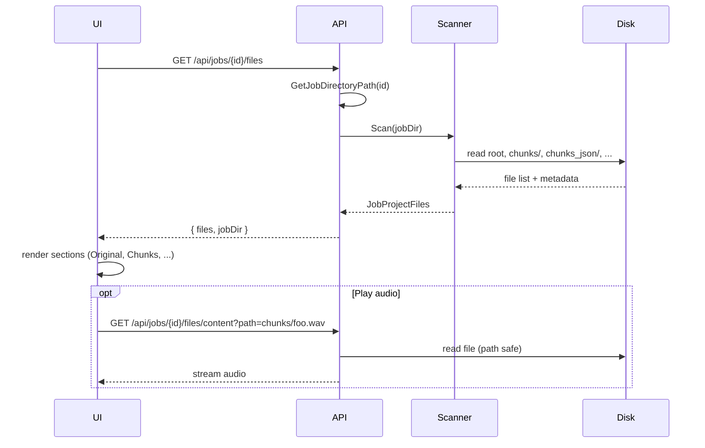

# XtractManager (agent05-ui-control)

Аналог agent-browser: веб-UI и API для пайплайна **транскрипция (agent04) + refiner (agent06)**. Интеграция с agent04 и agent06 — только по **gRPC**.

## Структура

- **API/** — бекенд (.NET 9): решение `Api.slnx` (проекты Api, API.Tests). Сборка и запуск из `API/`.
- **UI/** — фронтенд (React 18 + Vite, TypeScript). Сборка и запуск из `UI/`.
- **docs/** — стандарты (API_STANDARDS.md, AUTH.md, FRONTEND_STANDARDS.md), паритет и сканер файлов (**JOB_FILES_SCANNER_AND_AGENTS.md**, **PARITY_MINIMUM_READINESS.md**).

## Запуск

### Требования

- .NET 9 (API)
- Node.js 18+ (UI)
- Запущенные **agent04** (gRPC) и **agent06** (gRPC) на нужных портах

### API

```bash
cd agent05-ui-control/API
dotnet build
dotnet run
```

По умолчанию API слушает **http://localhost:5010**.

**Логи консоли:** метки времени в **UTC** (настроено в `Program.cs`).

Для использования своих адресов agent04/agent06 задайте переменную окружения и при необходимости скопируйте/отредактируйте `appsettings.Development.json`:

```bash
# Windows (PowerShell)
$env:ASPNETCORE_ENVIRONMENT="Development"; dotnet run

# Windows (CMD) / Linux / macOS
set ASPNETCORE_ENVIRONMENT=Development   # CMD
dotnet run
```

В `appsettings.Development.json` по умолчанию: Agent04 gRPC — http://localhost:5032, Agent06 — http://localhost:5033. Адреса можно изменить там же. У **Agent04** публичный API только **gRPC** на этом порту (h2c).

### UI

```bash
cd agent05-ui-control/UI
npm install
npm run dev
```

UI откроется на **http://localhost:5173** и по прокси обращается к API на http://localhost:5010. Убедитесь, что API запущен.

Сборка UI для продакшена:

```bash
npm run build
```

Артефакты — в `UI/dist/`.

**Тема:** в шапке кнопка переключения **светлая / тёмная** (тусклая); выбор сохраняется в `localStorage` (`xtract-theme`). Первый визит без сохранённого значения учитывает `prefers-color-scheme: dark`.

**Широкий экран.** Край списка заданий слева перетаскивается мышью; стрелки на клавиатуре тоже двигают его, двойной щелчок возвращает обычные 280 px. Ширина хранится в `localStorage` (`xtract-sidebar-width`) и не превышает 60 % ширины страницы. Чем шире список, тем больше в нём о каждом задании (`sidebarDetail` в `UI/src/utils/sidebarWidth.ts`):

| Ширина списка | Что видно о задании |
|---|---|
| до 380 px | имя в одну строку, состояние, одна дата |
| от 380 px | имя целиком (две строки), фаза |
| от 560 px | id, дата создания и завершения, сведения из списка уроков: урок и запись, дорожка или диалог, модель, доли испанского и русского |
| от 900 px | то же таблицей, по колонке на каждый вид сведений |

Сведения об уроке список берёт из `GET /api/sessions` и читает его, только когда достаточно широк, чтобы их показать, или упорядочен по дате урока.

**Порядок списка.** Над списком стоит выбор порядка — по дате урока (так по умолчанию, новые уроки сверху) или по дате задания — и кнопка, которая переворачивает порядок; в таблице (от 900 px) то же делает щелчок по названию колонки «Урок» или «Создано / готово». Выбор хранится в `localStorage` (`xtract-jobs-sort`). В порядке по дате урока над заданиями каждого урока стоит его дата и число заданий. Внутри урока записи идут по времени начала, внутри записи — диалог, общая дорожка, участники по имени, из двух прогонов одной дорожки новый выше. Задания, которых список уроков не знает, стоят после всех уроков (`sortJobs` в `UI/src/utils/jobsSort.ts`). Список запрашивает все задания (`limit=1000`), а не последние 50, которые `GET /api/jobs` отдаёт без `limit`.

В основной части блоки страницы остаются полосами сверху вниз, а внутри полосы панели встают рядом, пока хватает места, и складываются друг под друга в узком окне: шаги, карточки долей речи и разговора, настройки refiner рядом с запуском, сведения о задании / ссылки / файлы, разделы файлов, карточки чанков (две в ряд, когда блоку чанков достаётся от ≈ 3000 px — экран ≈ 3400 px при узком списке заданий), записи одного урока. Раздел файлов с аудио занимает строку целиком: волне нужна длина.

### Вкладки Transcriber / Refiner / Result

- **Transcriber** — статус/фаза, логи (SSE), **панель управления чанками** (запросы к Agent04: отмена чанка и пр.; опционально фильтр списка файлов по индексу чанка), полный список файлов проекта (`jobDir`, обновление списка).
- **Refiner** — те же **логи** (тот же буфер, что и у задания; отдельный поток только под рефайнер или фильтр по фазе **не реализованы**), блок как на **Result**: метаданные (Job ID, файл, статус, фаза, путь к папке), быстрые ссылки на ключевые файлы, список транскриптов с редактором. Подсказки по фазе (`awaiting_refiner` / `refiner` / `completed`) над логами.
- **Result** — **логи** (тот же буфер SSE, что на Transcriber/Refiner), затем **ResultSection**: метаданные, быстрые ссылки в браузере на `transcript.md`, `transcript_fixed.md`, нумерованные **`transcript_fixed_*.md`** (например `transcript_fixed_1.md`), `response.json`, список транскриптов с редактором.

Опционально из плана паритета со старым UI **не делаются** без доработки API: превью текста рефайнинга из логов (`RefiningTextPreview`), кнопки повторного запуска / пропуска рефайнера.

## Конфигурация API

Файл: `API/appsettings.json` (и при необходимости `appsettings.Development.json`).

| Секция       | Ключ           | Описание                                              |
|-------------|----------------|--------------------------------------------------------|
| Kestrel     | Endpoints:Http | URL API (по умолчанию http://localhost:5010)          |
| Agent04     | GrpcAddress   | Адрес **gRPC** agent04 (транскрипция), h2c: **http://localhost:5032**. REST у agent04 нет. |
| Agent04     | ConfigPath    | Путь к конфигу agent04 (например config/default.json) |
| Agent04     | WorkspaceRoot | Рабочий каталог agent04 (пустой — подставляется Jobs:WorkspacePath) |
| Agent06     | GrpcAddress   | Адрес gRPC agent06 (refiner)                          |
| Agent06     | WorkspaceRoot | Корень workspace **agent06** (как `WorkspaceRoot` в appsettings agent06). Пайплайн передаёт **`job_directory_relative`** (= id задания) и **`output_file_path`** `transcript_fixed.md`, чтобы результат лежал в папке job. Пустая строка или отсутствие ключа — используется тот же каталог, что и **Jobs:WorkspacePath**. |
| Jobs        | WorkspacePath | Каталог для рабочих данных заданий (аудио, артефакты). Абсолютный путь или относительный от Content Root. По умолчанию `./runtime`. Логи приложения — в корень запущенного проекта. |
| Xtract      | RequireAgent06WorkspaceMatchesJobs | Если **true**, при старте API сравниваются полные пути **Jobs:WorkspacePath** и **Agent06:WorkspaceRoot** (когда оба заданы); при расхождении приложение **не стартует**. По умолчанию **false** — только предупреждение в логе. |
| Recordings  | RootPath | Папка записей уроков для списка **Уроки** (`GET /api/sessions`). Только чтение. Пусто или нет папки — список выключен. |
| Recordings  | EstimateUsdPerMinute | Верхняя оценка цены минуты аудио, по которой UI показывает стоимость запуска до его старта. По умолчанию **0.017**. |
| Recordings  | ParticipantTrackModel | Модель, которой идёт **дорожка участника**, запущенная из списка уроков без названной модели. По умолчанию **`gpt-transcribe`**. Пустое значение — дорожки участников идут моделью общего config agent04, как общая дорожка. |
| Recordings  | ParticipantTrackEstimateUsdPerMinute | Верхняя оценка цены минуты дорожки для этой модели. По умолчанию **0.01**. |

При старте в лог выводится фактический путь: `Job workspace base path (Jobs:WorkspacePath): ...`. Оба внешних сервиса вызываются только по gRPC; REST для agent06 не используется.

### Контракт workspace (Agent04 / Xtract / Agent06)

- Раскладка: **`{workspace}/{jobId}/`** — аудио и все артефакты транскрипции Agent04; refiner читает/пишет в ту же папку при совпадающем корне и поле **`job_directory_relative`** на gRPC.
- **ChunkCommand:** Xtract всегда передаёт **`job_directory_relative`**, чтобы отмена чанков попадала в `.agent04_chunk_cancel/...` внутри папки задания (и дублирует смысл in-process registry в Agent04).
- Если **намеренно** разные корни у заданий Xtract и у Agent06, одного **`job_directory_relative`** недостаточно: пути в каждом gRPC должны быть относительно **`WorkspaceRoot`** того сервиса, который их обрабатывает.

### gRPC по HTTP (без TLS)

При работе по `http://` (без HTTPS) gRPC использует HTTP/2 «prior knowledge» (h2c). Чтобы избежать ошибки `HTTP_1_1_REQUIRED` (0xd):

- **agent05**: в `Program.cs` включён `AppContext.SetSwitch("System.Net.Http.SocketsHttpHandler.Http2UnencryptedSupport", true)` — клиент подключается по h2c к agent04 и agent06.
- **agent04**: на Windows без TLS Kestrel по умолчанию не включает HTTP/2. В Agent04 в `Program.cs` настроен порт **5032** только для gRPC (h2c): `ConfigureKestrel` с `AllowAlternateSchemes = true` и `ListenLocalhost(5032, HttpProtocols.Http2)`. Адрес `Agent04:GrpcAddress` в agent05 — **http://localhost:5032**.

## Endpoints

| Метод  | Путь                    | Описание |
|--------|-------------------------|----------|
| GET    | /health                 | Проверка состояния (JSON: status, service) |
| GET    | /api/jobs               | Список заданий. Query: semanticKey, status, from, to, limit, offset. Ответ: `{ "jobs": JobListItem[] }`. |
| GET    | /api/jobs/{id}          | Снепшот задания (JobSnapshot). 404 если нет. Поле `files` в JSON больше не заполняется — список файлов: **GET /api/jobs/{id}/files**. Во время транскрипции могут быть **`agent04JobId`**, **`chunks`** (`total`, `completed`, `active`, …). Поле **`runSettings`** — с какими настройками шёл запуск (см. «Настройки запуска»). Поле **`lesson`** — задание держит урок (см. «Запуск refiner»). |
| POST   | /api/jobs/{id}/chunk-actions | Операторские действия по чанку → gRPC Agent04 `ChunkCommand`. Тело JSON: **`action`**: `cancel` \| `skip` \| `retranscribe` \| `split`, **`chunkIndex`**: неотрицательный индекс (0-based). Допустимо только при **`phase`** = `transcriber` и **`status`** = `running`. Ответ 200: `{ "ok": bool, "message": string }`. Ошибки gRPC: 400 / 404 / 409 / 502. |
| POST   | /api/jobs               | Создать задание. Form: file (обязательно), tags (опционально, строка через запятую), **settings** (опционально: JSON-объект настроек этого задания — `silence_compress_enabled`, `silence_keep_sec` 0,05–5, `model`; например `{"silence_keep_sec":1.0}`; пишется в `job_settings.json` в папке задания, agent04 кладёт его поверх общего config; чужой ключ или значение вне границ — 400, задание не создаётся). Ответ: 202, `{ "jobId": string }`. Пайплайн запускается в фоне (agent04 → agent06). Лимит тела запроса 512 MB. |
| DELETE | /api/jobs/{id}          | Удалить задание. 204 при успехе, 404 если нет. |
| GET    | /api/jobs/{id}/stream   | SSE: первый ответ — snapshot (type: "snapshot", payload: JobSnapshot), далее события type: "status" | "done". При "done" стрим завершается. |
| POST   | /api/jobs/{id}/refine | **Запустить refiner вручную** или пропустить его. Тело JSON: `{ "skip"?: bool, "inputFile"?: string, "prompt"?: "lesson" или "saved" }`. Ответ **202**: `{ "ok", "message": "refiner_started", "inputFile", "prompt" }`; при `skip` — **200** `{ "ok", "message": "refiner_skipped" }`. 400 — неизвестный `prompt` или негодный `inputFile`; 404 — задания нет; 409 — транскрипта ещё нет или refiner уже идёт. См. ниже. |
| GET    | /api/jobs/{id}/files    | Структурированный список файлов задания (как в agent-browser). См. ниже. |
| GET    | /api/jobs/{id}/language-share | **Доли речи:** сколько речи задания идёт по-испански и сколько по-русски; у задания-диалога — по каждой дорожке и сумма, плюс паузы и перебивания (`conversation`). 404, если папки задания нет. См. ниже. |
| GET    | /api/jobs/{id}/files/content | Отдача файла из каталога задания по относительному пути. Query: **path** (обязательно), например `path=chunks/foo_part_000.wav`. Поддержка Range для аудио. |
| PUT    | /api/jobs/{id}/files/content | Перезапись **существующего** текстового файла (UTF-8 без BOM). Тот же query **path**. Тело запроса — сырое содержимое (`text/plain` или любой тип). Расширения: `.md`, `.txt`, `.json`, `.log`, `.text`, `.srt`, `.vtt`, `.csv`, `.xml`, `.flag`. Лимит тела 50 MB. Ответ 200: `{ "ok": true, "message": "..." }`. |
| POST   | /api/jobs/dialogue     | Собрать **диалог из дорожек участников**. Тело JSON: `{ "title"?: string, "tracks": [{ "jobId": string, "speaker": string, "file"?: string }] }` (2–8 дорожек). Модель не вызывается, refiner не запускается. Ответ **201**: `{ "jobId", "file", "entries", "tracks": [...], "warnings": [...] }`. 400 — плохой запрос, 404 — задание дорожки не найдено. См. ниже. |
| POST   | /api/jobs/{id}/dialogue/rebuild | Собрать диалог заново из тех же дорожек (например, после повторной транскрипции дорожки). Пишет **новый** `transcript_dialogue_<время>.md`, прежние файлы не трогает. Ответ **200** той же формы; 400 — задание не диалог, 404 — нет задания. |
| GET    | /api/sessions          | **Уроки из папки записей** (`Recordings:RootPath`): урок → период → дорожка, у каждой дорожки — задания, которые её транскрибировали, у периода — собранные из них диалоги. Ответ **200**: `{ "enabled", "rootPath", "estimateUsdPerMinute", "participantTrackModel", "participantTrackEstimateUsdPerMinute", "sessions": [...] }`; папка не задана или не существует — `enabled: false` и пустой список. Папка только читается. См. ниже. У каждого запуска дорожки поле **`settings`** — то же, что `runSettings` задания. |
| POST   | /api/sessions/runs     | Запустить задание по дорожке урока. Тело JSON: `{ "track": string, "settings"?: { ... } }` — `track` это `id` дорожки из `GET /api/sessions`, `settings` — те же ключи, что у поля формы `settings` в `POST /api/jobs`. Файл **копируется** в новую папку задания и идёт обычным pipeline (**транскрипция платная**). Дорожке **участника**, у которой в `settings` нет `model`, ставится модель из `Recordings:ParticipantTrackModel` (по умолчанию `gpt-transcribe`); общая дорожка идёт моделью общего config. Ответ **202**: `{ "jobId" }`. 400 — нет `track` или неверные настройки, 404 — такой дорожки в папке записей нет или папка не задана. |

### Диалог из дорожек: `POST /api/jobs/dialogue`

Zoom пишет каждого участника в свой файл. Каждая дорожка транскрибируется обычным заданием, а диалог — это строки всех дорожек под **именами участников** в порядке времени:

- В дорожке один голос, поэтому любая метка `speaker_N` её строк заменяется на `speaker` из запроса. Строки не склеиваются и не режутся: в диалоге ровно одна строка на каждую строку дорожек; при равном времени порядок — как в `tracks`.
- Источник дорожки — `file` (голое имя `.md` в папке задания, можно и `transcript_fixed_*.md`), иначе **самый новый** `transcript*.md` без `_fixed` — то же правило, что у входа refiner. Задания дорожек только читаются.
- Диалог живёт **отдельным заданием**: в его папке `transcript_dialogue_<yyyyMMdd_HHmmss_fff>.md` (тот же формат `>>>>>>>` / `<<<<<`) и `dialogue.json` (дорожки и журнал слияний). Фаза задания — `awaiting_refiner`, тег — `dialogue`; refiner запускается только вручную, как у обычных заданий. После перезапуска API имя задания в списке берётся из `title` в `dialogue.json`.
- Чанк, который вернулся **без отметок времени** (в `chunks_json/X.json` есть `text`, но нет `segments`), в transcript дорожки — одна строка на времени начала чанка. В диалоге такая строка получает метку `<speaker> (без времени)`, а в `warnings` идёт пояснение.
- Чанк без отметок времени, который оператор потом разделил (**Split**) и транскрибировал по частям, строкой «без времени» не считается: в transcript стоят строки частей (`split_chunks/chunk_N/chunk_N_merged.md`). Если без отметок времени вернулась часть такого чанка, об этом говорит строка в `warnings`; её текст не помечается.
- Время строк берётся из дорожек как есть. Agent04 при сжатии тишины сам возвращает времена на шкалу записи (`timeline/speech_map.json`). У задания, транскрибированного со сжатием **до** появления этой таблицы, времена остались на сжатой шкале — про такую дорожку в `warnings` идёт предупреждение, её реплики могут стоять не по порядку.

Пример:

```bash
curl -X POST http://localhost:5010/api/jobs/dialogue -H "Content-Type: application/json" --data-binary @dialogue.json
```

### Запуск refiner: `POST /api/jobs/{id}/refine`

Refiner никогда не запускается сам: оператор смотрит транскрипт и запускает его кнопкой **Run Refiner** (или пропускает — `skip: true`, задание сразу становится `completed`). `inputFile` — голое имя combined-транскрипта в папке задания (не `_fixed`); без него берётся самый новый.

Поле **`prompt`** выбирает, с чем идёт запуск (`RefinerRunPlan`):

| `prompt` | Что уходит в agent06 |
|---|---|
| `lesson` | Запуск **по словам под сомнением** (`candidates_only`). agent06 сам находит слова, которые могут быть испанскими, но записаны кириллицей или буквами двух алфавитов, спрашивает модель только о том, на каком языке сказано каждое, и пишет написание, которое уже есть в этой расшифровке (например «вале» → «vale», «Теngo» → «Tengo»). Строк модель не возвращает. Prompt и модель — собственные agent06 (`gpt-4.1-mini`); сохранённые настройки не используются. |
| `saved` или поле не названо | Настройки вкладки Refiner (`GET` / `PUT /api/refiner/settings`): свой prompt, размер блока, модель. Модели уходит каждая строка, и берётся она такой, как её написала модель. Так шёл любой запуск до появления выбора. |

Другое значение — **400**, запуск в очередь не ставится.

Снепшот задания несёт поле **`lesson`** (bool): в папке задания есть `track_source.json` (запуск из списка уроков) или `dialogue.json` (диалог из дорожек). UI для такого задания предлагает `lesson` первым, для обычной загрузки — `saved`; выбор оператора держится за тем заданием, для которого сделан. Правила запуска `lesson`, его замер и пределы — в README agent06, раздел «Words in doubt». В таблице хода refine у такого запуска строка — один запрос к модели: над строками запроса показаны слова, о которых она спрошена (поле `asked` события `refine_progress`, `askedWords` в `GET /api/jobs/{id}/refine-batches`).

Фаза задания следует за запуском: `refiner` / `running` на время работы (второй запуск получает **409**), `completed` / `done` после неё, `awaiting_refiner` / `failed` при сбое. Так же ведёт себя задание, которое сервис нашёл на диске (после перезапуска agent05 это все задания): при первом обновлении оно берётся в память с фазой и статусом из `xtract_ui_state.json`, чанки по-прежнему читаются из папки. Если в этом файле осталась фаза `refiner`, а сервис такого запуска не ведёт, значит запуск оборвался вместе с прежним процессом: задание читается как `awaiting_refiner` / `failed`, и его можно запустить заново.

### Настройки запуска: поле `runSettings`

Снепшот задания (`GET /api/jobs/{id}`, первый кадр и обновления SSE) несёт поле `runSettings`, запуск дорожки в `GET /api/sessions` — такое же поле `settings`:

```json
{ "source": "run", "model": "gpt-4o-transcribe-diarize", "silenceCompress": true, "silenceKeepSec": 1.0, "fromJobSettings": ["silence_keep_sec"] }
```

Значения читаются из папки задания при каждом запросе и нигде не хранятся; папка только читается. Чего папка не говорит, приходит как `null` — из сегодняшнего общего config ничего не подставляется, задание прошлого месяца шло с другим.

| `source` | Откуда значения | Что известно |
|----------|-----------------|--------------|
| `run` | `run_settings.json` — agent04 пишет его при приёме задания | модель, сжатие, пауза, какие ключи задал оператор — точно |
| `artifacts` | задание старше этой записи: `timeline/speech_map.json` (`keep_silence_sec`), иначе самый свежий `converted_wav/*.silence_report.json` (`KeepSilenceSec`) — сжатие было; только `converted_wav/*.silence_detect.json` — сжатия не было | сжатие и пауза; модель — только если оператор задал её в `job_settings.json`, иначе `null` |
| `job_settings` | задание ещё не шло: `job_settings.json` | только то, что задал оператор |

`silenceKeepSec` приходит, только когда сжатие не выключено. Папка без этих файлов (задания первого поколения, задание-диалог) даёт `runSettings: null`, и UI строку не показывает.

### Доли речи: `GET /api/jobs/{id}/language-share`

Ответ: `{ total, tracks, conversation }`. У задания-транскрипции есть только `total`; у задания-диалога (`dialogue.json`) `tracks` — по записи на дорожку (`jobId`, `speaker`, `share`), а `total` — их сумма. `total` и `share` одной формы:

```json
{ "lines": 412, "spanishLines": 250, "russianLines": 140, "mixedLines": 22, "untimedLines": 0,
  "speechSeconds": 1890.4, "spanishSeconds": 1304.2, "russianSeconds": 498.1, "mixedSeconds": 88.1 }
```

Как считается (`JobLanguageShareReader`, папка задания только читается):

- Строки — сегменты ответов `chunks_json/*.json`; секунды строки — `end − start` её сегмента, паузы между строками в счёт не идут. Сегмент, который начинается внутри защитной зоны чанка (`emit_guard_sec` в `timeline/chunks.json`), повторяет конец предыдущего чанка и не считается — как в transcript. Сегмент с обеими отметками 0 — строка без времени.
- Язык строки виден по письму: слово латиницей — испанское, слово с кириллической буквой — русское. Строка испанская, когда латиницей не меньше 70 % её слов, русская — когда не больше 30 %, иначе смешанная. Испанская речь, записанная кириллицей (так пишет модель `gpt-4o-transcribe-diarize`), попадёт в русскую — на заданиях этой модели цифра занижает испанский.
- Чанк, который оператор разделил и склеил (`split_chunks/chunk_N/chunk_N_merged.md`), считается по ответам частей (`results/sub_chunk_*_result.json`), а не по своему старому ответу.
- Ответ без отметок времени (текст без сегментов) даёт строки без секунд: они в `lines` и `untimedLines`, в секундах их нет.
- Правки, сделанные руками в `chunks_md` и в transcript, здесь не видны.

`total: null` (и `share: null` у дорожки) — считать нечего: ответов чанков ещё нет или задание дорожки удалено. Данные читаются по запросу, в снепшот задания не входят: чтение открывает все ответы чанков. UI показывает под строкой настроек запуска «Речь 31,5 мин: испанский 69 % · русский 26 % · смешанные строки 5 %», у диалога — итог и по строке на дорожку с её долей всей речи.

#### Как идёт разговор: блок `conversation`

Только у задания-диалога: кто говорит поверх кого и кто сколько ждёт. Считает `ConversationStats` по строкам дорожек, поставленным на общую шкалу записи (`JobTimedLinesReader`).

```json
{ "longPauseSeconds": 3, "spanSeconds": 2394.1, "overlapSeconds": 288.4, "silenceSeconds": 384.0, "speakerChanges": 399,
  "tracks": [
    { "jobId": "a1b2c3d4e5f6", "speaker": "Ученик", "lines": 301, "interruptions": 12, "backchannels": 28, "overlapSeconds": 288.4,
      "longPausesBeforeAnswer": 9, "longestPauseBeforeAnswerSeconds": 6.04, "medianAnswerGapSeconds": 0.5,
      "longPausesInOwnSpeech": 5, "longestPauseInOwnSpeechSeconds": 4.5 }
  ] }
```

- Строка — отрезок речи между паузами около секунды; её начало и конец переводятся на шкалу записи: смещение чанка из `timeline/chunks.json`, при вырезанной тишине — таблица `timeline/speech_map.json`.
- **Поверх чужой речи** сказана строка, которая началась, когда строка другого участника шла уже не меньше 0,3 с и продлилась ещё не меньше 0,3 с. Короткая (не больше 2 слов и 1,5 с) — поддакивание (`backchannels`). Иначе, если двое затем говорят вместе не меньше 1,0 с, — перебивание (`interruptions`). Если меньше — это быстрая смена говорящего: строка считается ответом без ожидания.
- **Пауза** перед строкой, начатой в тишине, — от конца речи, которая закончилась последней. После другого участника это ожидание перед ответом (`medianAnswerGapSeconds` — обычное, медиана; `longPausesBeforeAnswer` — сколько раз от `longPauseSeconds`; `longestPauseBeforeAnswerSeconds`), после своей строки — пауза в своей речи (`longPausesInOwnSpeech`, `longestPauseInOwnSpeechSeconds`). `medianAnswerGapSeconds: null` — участник ни разу не отвечал другому.
- `spanSeconds` — от начала первой строки до конца последней; `overlapSeconds` — секунды, когда говорят двое и больше (у дорожки — когда она говорит вместе с другой); `silenceSeconds` — никто не говорит; `speakerChanges` — сколько строк идёт после строки другого участника.
- **Точность.** Пауза короче секунды внутри строки считается речью, поэтому `overlapSeconds` — оценка сверху; времена точны до нескольких десятых секунды. Пороги — константы `ConversationStats`.
- `conversation: null`, когда строки хотя бы одной дорожки нельзя поставить на шкалу записи: у её задания нет `timeline/chunks.json` (задание старше этого файла), аудио сжато без `speech_map.json`, или чанк склеен оператором из частей; также когда строки есть меньше чем у двух дорожек. Доли речи при этом считаются как обычно.

UI показывает под долями диалога: «Разговор 39,9 мин: говорят одновременно 4,8 мин · тишина 6,4 мин · смен говорящего 399» и по строке на участника: «Ученик — перебиваний 12 · поддакиваний поверх речи 28 · обычная пауза перед ответом 0,5 с · пауз от 3 с: перед ответом 9 (до 6,0 с), в своей речи 5 (до 4,5 с)».

#### Доли в списке уроков: поле `share` запуска

Каждый запуск дорожки в `GET /api/sessions` несёт `share` той же формы, что `total` (`null`, пока нет ни одного ответа чанка). UI показывает его коротко рядом с запуском: «es 74 % · ru 18 %» — доли секунд речи по-испански и по-русски, остаток до 100 % — смешанные строки; полная строка — в подсказке запуска.

Чтобы список не открывал ответы чанков всех заданий при каждом запросе, доли хранит `JobLanguageShareCache` (в памяти процесса): доля задания считается один раз и пересчитывается, когда меняется число, общий размер или самое позднее время записи файлов, по которым она считается (`chunks_json/*.json`, `timeline/chunks.json`, склейки и ответы частей в `split_chunks`). Первый список после запуска agent05 считает доли всех заданий, параллельно; дальше список открывается так же быстро, как без долей.

На заданиях модели `gpt-4o-transcribe-diarize` испанский занижен (испанское, записанное кириллицей, идёт в русское), поэтому запуски разных моделей по этой цифре сравнивать нельзя.

### Уроки из папки записей: `GET /api/sessions`, `POST /api/sessions/runs`

Ключ **`Recordings:RootPath`** в `API/appsettings.json` — папка, где лежат записи уроков. API её **только читает**: ничего не пишет, не переносит и не удаляет. Пустой ключ или несуществующая папка выключают список уроков (`enabled: false`).

Что сканер считает уроком:

- **Папка дня** `ГГГГ.ММ.ДД[ название]`. Внутри — папки периодов Zoom `ГГГГ-ММ-ДД ЧЧ.мм.сс <название встречи>`: общий файл `audio<id>.m4a` — дорожка `mixed`, файлы в `Audio Record/` (`audio<Имя><N><id>.m4a`) — дорожки `participant` с именем участника из имени файла.
- **Старые папки дня** с аудио прямо внутри: каждый аудиофайл — период с одной дорожкой `mixed`; время начала берётся из имени файла, если оно там есть.
- **Папки периодов в корне** (не разложенные по дням) собираются по дате в урок с `loose: true` и `id` вида `@loose/ГГГГ-ММ-ДД`.

Остальное в корне (книги, папка репозитория) пропускается. У периода: `state` — `ready` (есть аудио), `unconverted` (только сырые `.zoom`: Zoom ещё не сконвертировал запись) или `empty`; признаки `hasVideo`, `hasChat`, `hasSubtitles`, `hasOldTranscript` (рядом со старой записью лежит `*transcript*.md`); `rawZoomBytes` — сколько занимают оставшиеся сырые `.zoom`. У дорожки: `durationSec` (из заголовка файла, читается один раз за жизнь процесса), `sizeBytes`, `runs`.

Задание привязывается к дорожке одним из трёх способов:

1. по **`track_source.json`** в папке задания — его пишет `POST /api/sessions/runs` (путь дорожки от корня папки записей, имя и размер файла, урок, период, участник);
2. по **имени и размеру** аудиофайла в папке задания — так находятся задания, загруженные обычным `POST /api/jobs`, и дорожки, чью папку потом перенесли;
3. по **размеру и первым 64 КБ** файла — если ту же дорожку загрузили под другим именем.

Диалог (`dialogue.json`) показывается у того периода, из запусков чьих дорожек он собран.

`estimateUsdPerMinute` — верхняя оценка цены минуты аудио для модели с диаризацией (по умолчанию **0.017**, замер по tokens от 13.11.2026; меняется ключом `Recordings:EstimateUsdPerMinute`). UI показывает по ней «не больше $X» на кнопке **Расшифровать** и ещё раз — в подтверждении перед запуском.

**Модель дорожки участника.** Дорожка участника — запись одного голоса: говорящих различать не нужно, зато важно, чтобы испанская речь была записана по-испански, а русская по-русски. Поэтому `POST /api/sessions/runs` для дорожки вида `participant`, у которой в `settings` не названа модель, сам дописывает в `job_settings.json` модель из ключа **`Recordings:ParticipantTrackModel`** (по умолчанию **`gpt-transcribe`**; как agent04 транскрибирует таким заданием — `agent04/README.md`, «Plain-text model»). Названная в `settings` модель остаётся как есть; общая дорожка (`mixed`) и обычная загрузка файла (`POST /api/jobs`) идут моделью общего config agent04. Пустой ключ выключает правило; значение, которое не является идентификатором модели, не применяется, в лог идёт предупреждение. Ответ `GET /api/sessions` несёт **`participantTrackModel`** (или `null`) и **`participantTrackEstimateUsdPerMinute`** — верхнюю оценку цены минуты дорожки для этой модели (по умолчанию **0.01**: звук спрашивается дважды по 0,0045 $ за минуту и немного сверх того; прогоны 14.11.2026 стоили около 0,006 $ за минуту дорожки; ключ `Recordings:ParticipantTrackEstimateUsdPerMinute`). UI считает оценку запуска по модели, которой задание пойдёт: выбранной в форме, иначе — модели дорожки; в подтверждении для дорожки участника сказано, какой моделью она пойдёт, а пустой пункт списка моделей называет её вместо «как в общем config».

UI: кнопка **Уроки** в шапке открывает список. Из него можно открыть любое задание дорожки, запустить новое (платно, после подтверждения, с настройками этого задания) и собрать диалог из дорожек участников (бесплатно, `POST /api/jobs/dialogue`).

### Файлы проекта: `GET /api/jobs/{id}/files`

Ответ **200**: `{ "files": { ... }, "jobDir": "<абсолютный путь к каталогу задания>" }`.

Объект **`files`** (имена полей в JSON — camelCase):

| Поле | Описание |
|------|----------|
| `original` | Корневые аудио (m4a, mp3, wav, ogg, flac). |
| `transcripts` | Корневые транскрипты/JSON: имя содержит `transcript`, или `.md`, или `.json`. |
| `chunks` | Файлы в `chunks/` (индекс чанка из имени файла). |
| `chunkJson` | Файлы в `chunks_json/`. |
| `intermediate` | `intermediate_results/`. |
| `converted` | `converted_wav/`. |
| `splitChunks` | `split_chunks/chunk_N/…` (аудио подчанков и результаты в `results/`). |

Элемент списка — объект с полями вроде `name`, `relativePath`, `sizeBytes`, `kind` (`text` | `audio` | `other`), при необходимости `lineCount`, `durationSeconds`, `index`, `parentIndex`, `subIndex`, `hasTranscript`, `isTranscript`.

#### Сканер vs Agent04 / Agent06 (§6 плана)

Кратко: **Agent04** при типичном `default.json` заполняет `chunks/`, `chunks_json/`, `converted_wav/`, `intermediate_results/`, корневые транскрипты; **не** создаёт `split_chunks/chunk_*`. **Agent06** добавляет в основном **`transcript_fixed*.md`** в корень задания (категория `transcripts`). Подробные таблицы, паттерны имён и расхождения — **[docs/JOB_FILES_SCANNER_AND_AGENTS.md](docs/JOB_FILES_SCANNER_AND_AGENTS.md)**.

**404**: каталог задания на диске отсутствует. Если задания нет и в хранилище — тело пустое; если задание есть в store, но папки нет — `{ "error": "job directory not found" }`.

**Архивные задания**: если каталог `{id}` под `Jobs:WorkspacePath` есть, а записи в store уже нет, ответ **200** всё равно возвращается (удобно для папок, оставшихся после перезапуска).

### Раздача файла: `GET /api/jobs/{id}/files/content?path=...`

- **path** — путь **относительно** каталога задания, сегменты `.` и `..` запрещены; выход за пределы каталога даёт **403** `{ "error": "access denied" }`.
- **400**: нет `path` или неверный путь.
- **404**: нет каталога задания или файла.
- Тип содержимого выбирается по расширению (аудио, markdown, json и т.д.); иначе `application/octet-stream`.

UI использует эти эндпоинты для списка секций (Transcriber / Refiner / Result) и ссылок «Открыть» / `<audio src=…>`.

### Поток данных: структурированные файлы проекта (UI)

Схема из плана «Project files like old Transcriber tab»: UI не берёт дерево файлов из снапшота задания, а запрашивает отдельный ресурс; метаданные читает сканер с диска.


```mermaid
sequenceDiagram
  participant UI
  participant API
  participant Scanner
  participant Disk

  UI->>API: GET /api/jobs/{id}/files
  API->>API: GetJobDirectoryPath(id)
  API->>Scanner: Scan(jobDir)
  Scanner->>Disk: read root, chunks/, chunks_json/, ...
  Disk-->>Scanner: file list + metadata
  Scanner-->>API: JobProjectFiles
  API-->>UI: { files, jobDir }
  UI->>UI: render sections (Original, Chunks, ...)

  opt Play audio
    UI->>API: GET /api/jobs/{id}/files/content?path=chunks/foo.wav
    API->>Disk: read file (path safe)
    API-->>UI: stream audio
  end
```

### Сохранение текстового файла: `PUT /api/jobs/{id}/files/content?path=...`

Как в agent-browser: файл уже должен существовать; создать новый через этот эндпоинт нельзя. Недопустимые расширения → **400** `only text-like files can be saved`.

В Development при включённом OpenAPI: **GET /openapi/v1.json** — схема API.

## Тесты API

```bash
cd agent05-ui-control/API
dotnet test
```

Среди прочего: **`ChunkActionsControllerTests`** — `POST /api/jobs/{id}/chunk-actions` с моком **`ITranscriptionServiceClient`**.

## Документация и план

- **docs/API_STANDARDS.md** — стандарты бекенда.
- **docs/FRONTEND_STANDARDS.md** — стандарты фронтенда.
- **docs/AUTH.md** — закладка под авторизацию.
- **docs/JOB_FILES_SCANNER_AND_AGENTS.md** — каталоги и паттерны `JobProjectFilesScanner` (наследие agent-browser) и что реально пишут Agent04 / Agent06.
- **docs/PARITY_MINIMUM_READINESS.md** — чеклист **критерия готовности (минимум)** по плану паритета UI; все обязательные пункты закрыты, отказы явно помечены.
- План разработки и спецификация UI — в общем плане сервиса (agent05, этапы 1–9 и п. 4a).
